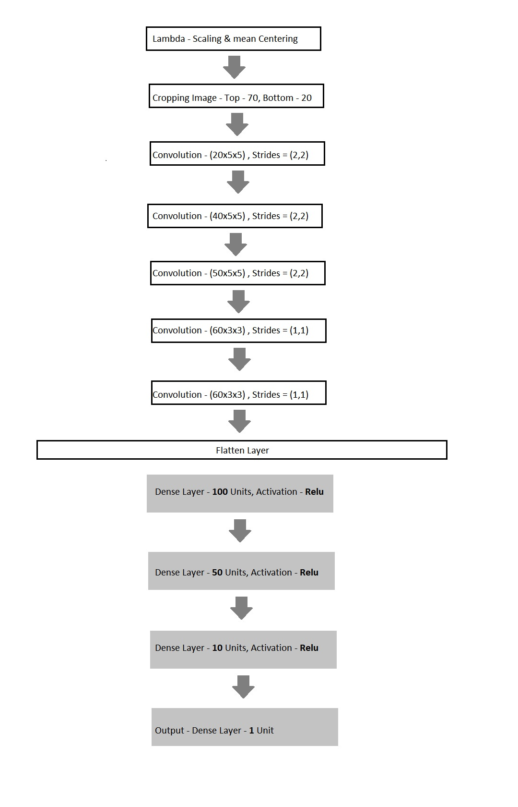

# **Behavioral Cloning** 

**Behavioral Cloning Project**

The goals / steps of this project are the following:
* Use the simulator to collect data of good driving behavior
* Build, a convolution neural network in Keras that predicts steering angles from images
* Train and validate the model with a training and validation set
* Test that the model successfully drives around track one without leaving the road
* Summarize the results with a written report


You can Download the simulator from this link - https://s3-us-west-1.amazonaws.com/udacity-selfdrivingcar/Term1-Sim/term1-simulator-windows.zip 


#### 1. Submission includes functional code
Using the provided simulator from above link and my drive.py file, the car can be driven autonomously around the track by executing 
```sh
python drive.py model.h5
```

#### 2. code is usable and readable

The model.py file contains the code for training and saving the convolution neural network. The file shows the pipeline I used for training and validating the model, and it contains comments to explain how the code works.


### Model Architecture and Training Strategy

#### 1. An appropriate model architecture has been employed

I started developing the model from LeNet Architecture then adding more layes and improving the performance, In very short time it started overfitting.

In line 71-92 in model.py the model architecture is implemented.
My model consists of a convolution neural network with 3 convolutional layers having 20, 40 and 50 5x5 filters with strides of size (2,2). Every convolutional layer is also succeeded by a relu activation function applied on it. After tha 2 convolutional layers with 60 and 60 filters of size 3x3 are used. A flattening layer is used to flatten the neurons for the dense layers.
Three Dense layers as hidden layers are used along with a layer for dropout optimization.
The model uses RMSprop optimizer and trained with 20% of data being used for validation.

The model includes RELU layers to introduce nonlinearity, and the data is normalized in the model using a Keras lambda layer. 

#### 2. Attempts to reduce overfitting in the model

Inially adding more convolutional layers also resulted in overfitting, removing them helped in managing the overfitting upto some extent.
The model contains dropout layers in order to reduce overfitting (model.py line 87). 

The model was trained and validated on different data sets to ensure that the model was not overfitting (code line 97 - 102). The model was tested by running it through the simulator and ensuring that the vehicle could stay on the track.

#### 3. Model parameter tuning

The model used an RMSprop optimizer (model.py line 95). Using RMSprop increased the converging rate. I also performed tuning by changing the number of filters on each convolutional layers and number of neurons on fully connected layers. 

#### 4. Appropriate training data

Training data was chosen to keep the vehicle driving on the road. I used a combination of center lane driving, recovering from the left and right sides of the road. While collecting data I also made the car to drive in reverse direction as well so that better data collection can be done. 

### Model Architecture and Training Strategy

#### 1. Solution Design Approach

The overall strategy for deriving a model architecture was to get as minimum gap between training loss and validation loss and then the car should drive on the track properly without getting out of the track.

Initially while working on this, starting with the NVIDIA model was the easiest thing to do but I wanted to explore if there is any other approach and then if things do not work out, I will get to NVIDIA model.

My first step was to use a convolution neural network model similar to the LeNet Architecuture. I thought this model might be appropriate because it worked earlier on some other cases, then getting ahead and customizing the NVIDIA model would be a good approach.

In order to gauge how well the model was working, I split my image and steering angle data into a training and validation set. 
Initially it gave bad performance on both train and validation data.
I removed the maxpooling layers and got some satisfactory results.
I kept on adding more layers of convolution with lower filter size and more dense layers as well.
I found that my first model had a low mean squared error on the training set but a high mean squared error on the validation set. This implied that the model was overfitting. 

To combat the overfitting, I modified the model so that the gap between the train and validation data loss reduces. I added couple of dropout layers but that made it underfit, then at the end i ended up having one dropout layer.

After some attempts I ended up having a hopeful model.
The final step was to run the simulator to see how well the car was driving around track one. There were a few spots where the vehicle fell off the track. 
to improve the driving behavior in these cases, I started working with data augementation and cropping area changes, changing the correction factor and indeed the model architecture.

##### Result After 5th Attempt


##### Result After 8th Attempt


##### Result After 10th Attempt


##### Result After 18th Attempt - Final model


After almost  18 attempts the model worked very well.
At the end of the process, the vehicle is able to drive autonomously around the track without leaving the road.

#### 2. Final Model Architecture

The final model architecture (model.py lines 71-92) consisted of a convolution neural network with the following layers and layer sizes 

1. Lambda Layer to scale images
2. Cropping layers to crop images 70 from top and 20 from bottom
3. Convolution layer with 20 filters of size 5x5 with relu activation and strides = (2,2)
4. Convolution layer with 20 filters of size 5x5 with relu activation and strides = (2,2)
5. Convolution layer with 40 filters of size 5x5 with relu activation and strides = (2,2)
6. Convolution layer with 50 filters of size 5x5 with relu activation and strides = (2,2)
7. Convolution layer with 60 filters of size 3x3 with relu activation and strides = (1,1)
8. Convolution layer with 60 filters of size 3x3 with relu activation and strides = (1,1)
9. Flatten layer
10. Dense layer with 100 units and relu activation
11. Dropout optimization 
12. Dense layer with 50 units and relu activation
13. Dense layer with 10 units and relu activation
14. Output layer - Dense layer with 1 unit 
 

Here is a visualization of the architecture 





#### 3. Creation of the Training Set & Training Process

To capture good driving behavior, I first recorded two laps on track one using center lane driving. Here is an example image of center lane driving:


I then recorded the vehicle driving in the reverse direction so that it can have balanced data for left and right direction.


To augment the data sat, I also flipped images and angles thinking that this would further create balanced data for left and right turns. 


After the collection process, I had 20400 number of data points. I then preprocessed this data by scaling the images by dividing them 255 and subtracting 0.5 from it for mean centering.
Cropping the images so that relevant area of image could be used for training.


I finally randomly shuffled the data set and put 20% of the data into a validation set. 

I used this training data for training the model. The validation set helped determine if the model was over or under fitting. The ideal number of epochs was 10. I used an RMSprop optimizer so that i could achieve faster convergance.

